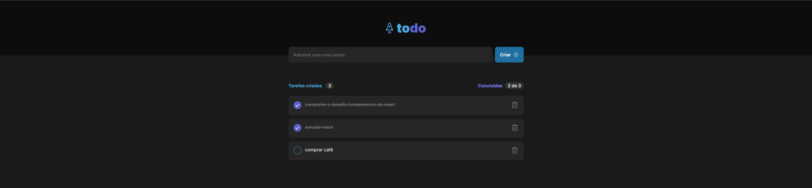

<p align="center">
  
   
  
</p>

<p align="center">
  <a href="#dart-sobre">Sobre</a> &#xa0; | &#xa0;
  <a href="#rocket-tecnologias">Tecnologias</a> &#xa0; | &#xa0;
  <a href="#warning-pré-requisitos"> Pré requisitos</a> &#xa0; | &#xa0;
  <a href="#checkered_flag-começando">Começando</a> &#xa0; | &#xa0;
  <a href="#memo-licença">Licença</a> &#xa0; | &#xa0;
  <a href="https://github.com/geovaneborba" target="_blank">Autor</a>
</p>

<br>

## :dart: Sobre

<p>
  Desafio realizado durante o programa ignite da <a href='https://www.rocketseat.com.br/' target="_blank">Rocketseat</a>  :rocket:, onde
  foi solicitado o desenvolvimento de uma aplicação de controle de tarefas no estilo to-do list, que contém as seguintes funcionalidades:

- Adicionar uma nova tarefa
- Marcar e desmarcar uma tarefa como concluída
- Remover uma tarefa da listagem
- Mostrar o progresso de conclusão das tarefas

Apesar de parecer poucas funcionalidades foi trabalhado conceitos importantes do react como por exemplo:

- Estados
- Imutabilidade do estado
- Listas e chaves no ReactJS
- Propriedades
- Componentização

🎯 <a href="https://efficient-sloth-d85.notion.site/Desafio-01-Praticando-os-conceitos-do-ReactJS-91fd63dd1a5b4a2796152de293ec1074" target="_blank">Clique aqui para acessar o desafio ⬅️</a>

Além de concluir o desafio eu também andei a milha extra e então adicionei uma funcionalidade para salvar as tarefas no localStorage utilizando um hook do React chamado useEffect, ele fica monitorando o array de tarefas, assim que uma nova tarefa for adicionada ele salva no localStorage. Quando a aplicação é executada pela primeira o estado de tarefas tenta buscar as informações no localStorage, caso não tenha nenhuma tarefa salva lá, então ele começa seu estado como um array vazio. Isso ajuda nos casos do usuário fechar a aplicação sem querer e perder todas suas tarefas...

</p>

<p align="right">(<a href="#top">Voltar para o topo</a>)</p>

## :rocket: Tecnologias

As seguintes tecnologias foram usadas na construção do projeto:

- [Vite](https://vitejs.dev/)
- [React](https://reactjs.org/docs/getting-started.html)
- [TypeScript](https://www.typescriptlang.org/)
- [Eslint](https://eslint.org/)
- [Prettier](https://prettier.io/)

<p align="right">(<a href="#top">Voltar para o topo</a>)</p>

## :warning: Pré-requisitos

Antes de começar, você precisa ter o [Git](https://git-scm.com) e o [Node](https://nodejs.org/en/) instalados em sua maquina.

<p align="right">(<a href="#top">Voltar para o topo</a>)</p>

## :checkered_flag: Começando

```bash
# Clone este repositório
$ git clone https://github.com/geovaneborba/rocketseat-ignite-desafios.git

# Entre na pasta
$ cd 01-praticando-os-conceitos-do-react

# Instale as dependências
$ npm install

# Para iniciar o projeto
$ npm run dev
# O app vai inicializar em < http://localhost:5173 />

```

<p align="right">(<a href="#top">Voltar para o topo</a>)</p>

## :memo: Licença

Este projeto está sob licença MIT. Veja o arquivo [LICENSE](LICENSE.md) para mais detalhes.

<p align="right">(<a href="#top">Voltar para o topo</a>)</p>

<p align="center">Feito com ❤️ por <a href="https://github.com/geovaneborba" target="_blank">Geovane Borba</a></p>
