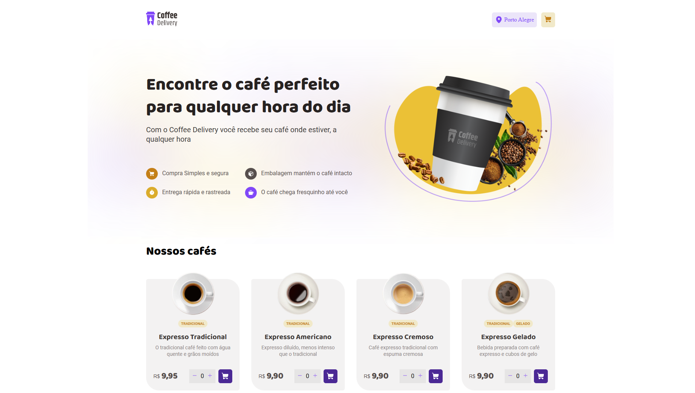

<p align="center">
  
   
  
</p>

<p align='center'>

</p>

<p align="center">
  <a href="#dart-sobre">Sobre</a> &#xa0; | &#xa0;
  <a href="#rocket-tecnologias">Tecnologias</a> &#xa0; | &#xa0;
  <a href="#warning-pré-requisitos"> Pré requisitos</a> &#xa0; | &#xa0;
  <a href="#checkered_flag-começando">Começando</a> &#xa0; | &#xa0;
  <a href="#memo-licença">Licença</a> &#xa0; | &#xa0;
  <a href="https://github.com/geovaneborba" target="_blank">Autor</a>
</p>

<br>

## :dart: Sobre

<p>
  Desafio realizado durante o programa ignite da <a href='https://www.rocketseat.com.br/' target="_blank">Rocketseat</a>, onde
  foi solicitado o desenvolvimento de uma aplicação para gerenciar um carrinho de compras de uma cafeteria fictícia, que contém as seguintes funcionalidades:

- Listagem de produtos (cafés) disponíveis para compra
- Adicionar uma quantidade específicas de itens no carrinho
- Aumentar ou remover a quantidade de itens no carrinho
- Formulário para o usuário preencher o seu endereço
- Exibir o total de itens no carrinho no Header
- Exibir o valor total da soma de itens no carrinho multiplicados pelo valor

Apesar de parecer poucas funcionalidades foi trabalhado conceitos importantes do react como por exemplo:

- Estados
- ContextAPI
- LocalStorage
- Imutabilidade do estado
- Listas e chaves no ReactJS
- Propriedades
- Componentização

🎯 <a href="https://efficient-sloth-d85.notion.site/Desafio-02-Coffee-Delivery-30e42a21fdb44b09a85244fc2c3dbdf9" target="_blank">Clique aqui para acessar o desafio ⬅️</a>

Além de concluir o desafio eu também adicionei algumas funcionalidades que eu achei que ficou legal :D como por exemplo:

- Responsividade, adaptei o layout para funcionar em dispositivos móveis
- Validação dos dados no formulário com React Hook Forms junto com o Zod
- Utilizei a API do ViaCEP para preencher o formulário, após o usuário informar o seu CEP
- Exibir uma mensagem (toast) quando o usuário adiciona um café ao carrinho
- Exibir uma mensagem (toast) quando o usuário remove um café ao carrinho
- Criei uma API Fake com os dados necessários para exibir a lista de produtos (cafés) na homepage

</p>

<p align="right">(<a href="#top">Voltar para o topo</a>)</p>

## :rocket: Tecnologias

As seguintes tecnologias foram usadas na construção do projeto:

- [Vite](https://vitejs.dev/)
- [React](https://reactjs.org/docs/getting-started.html)
- [TypeScript](https://www.typescriptlang.org/)
- [Eslint](https://eslint.org/)
- [Prettier](https://prettier.io/)
- [React Toastify](https://fkhadra.github.io/react-toastify/introduction)
- [React Hook Form](https://react-hook-form.com/)
- [ZOD](https://github.com/colinhacks/zod)
- [React Router](https://reactrouter.com/en/main)

<p align="right">(<a href="#top">Voltar para o topo</a>)</p>

## :warning: Pré-requisitos

Antes de começar, você precisa ter o [Git](https://git-scm.com) e o [Node](https://nodejs.org/en/) instalados em sua maquina.

<p align="right">(<a href="#top">Voltar para o topo</a>)</p>

## :checkered_flag: Começando

```bash
# Clone este repositório
$ git clone https://github.com/geovaneborba/rocketseat-ignite-desafios.git

# Entre na pasta rocketseat-ignite-desafios e logo após entre na pasta
# 02-coffee-delivery
$ cd rocketseat-ignite-desafios/02-coffee-delivery

# Instale as dependências
$ npm install

# Para iniciar o projeto
$ npm run dev

# O app vai inicializar e será informado no terminal o endereço e porta onde estará rodando a aplicação
# geralmente é http://localhost:5173/
```

<p align="right">(<a href="#top">Voltar para o topo</a>)</p>

## :memo: Licença

Este projeto está sob licença MIT. Veja o arquivo [LICENSE](LICENSE.md) para mais detalhes.

<p align="right">(<a href="#top">Voltar para o topo</a>)</p>

<p align="center">Feito com ❤️ por <a href="https://github.com/geovaneborba" target="_blank">Geovane Borba</a></p>
